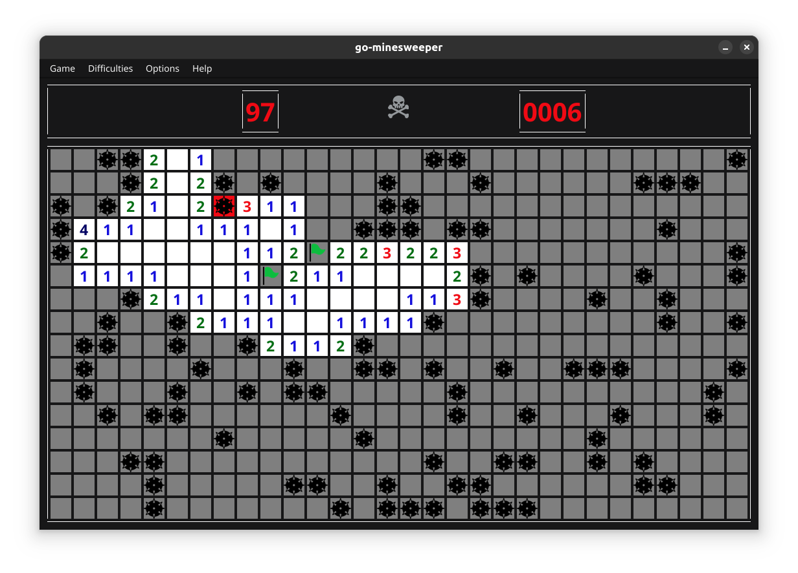
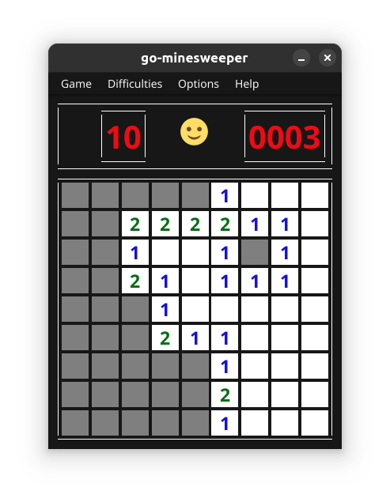
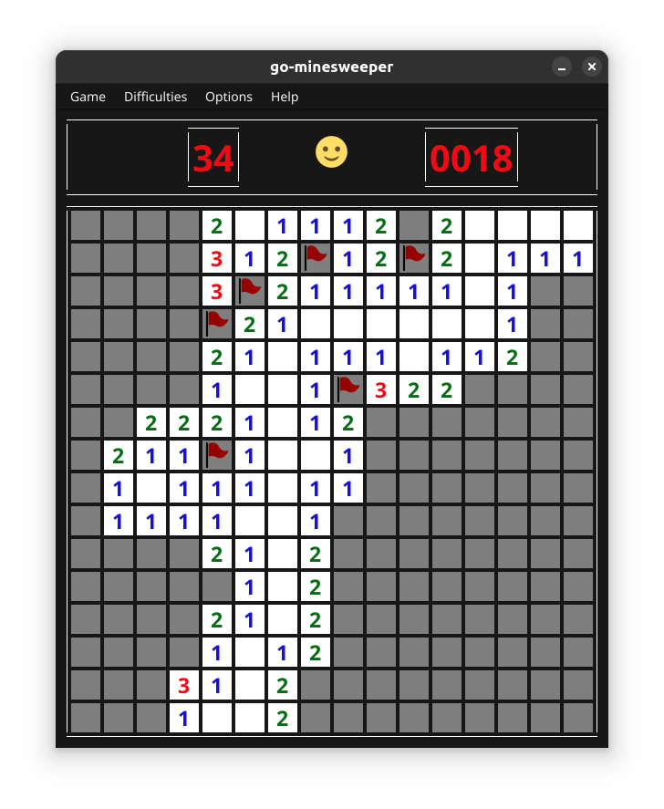

# Golang minesweeper

This is an implementation of minesweeper in golang, made with the ui framework fyne.io

## Table of Contents

- [Golang minesweeper](#golang-minesweeper)
  - [Table of Contents](#table-of-contents)
  - [Usage](#usage)
    - [Controls](#controls)
    - [Game options](#game-options)
    - [Changing difficulty](#changing-difficulty)
  - [Screenshots](#screenshots)
  - [Potential features](#potential-features)

## Usage

Or otherwise called how to play the Game.

Tip: The Game starts automatically when revealing the first field.

### Controls

To start a new game, you can click on the smiley between the mine count and the timer.

| Action                                        | control                             |
| --------------------------------------------- | ----------------------------------- |
| Reveal a field                                | left mouse button                   |
| Flag a field                                  | right mouse button                  |
| Reveal all none-flagged fields around a field | double click with left mouse button |

### Game options

The following options can be found under the Game menu

| Option | Description                                                                        |
| ------ | ---------------------------------------------------------------------------------- |
| New    | Start a new game, same as clicking the smiley between the mine count and the timer |
| Replay | Replay the current game                                                            |
| Quit   | Close the app                                                                      |

### Changing difficulty

To change the difficulty, select a new difficulty in the menu.

The custom option will open a dialog where you can create a custom difficulty.
It will tell you if your options don't work.

## Screenshots

## Potential features

1. Online play by saving highscores on a webserver
2. Compiling to web
3. Save a specific game to be able to play again
4. Create highscore list
